# Hardware

## Definição

> **É a parte física do computador. É o conjunto de componentes eletrônicos (circuitos integrados, placas, etc) com os quais são construídos os computadores e equipamentos periféricos.**

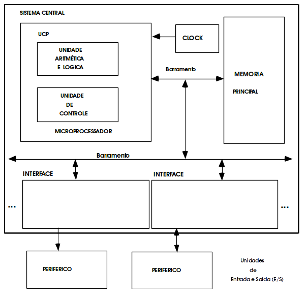

## UCP ou CPU

> A Unidade central de processamento (CPU, de acordo com as iniciais em inglês), ou processador, é a parte de um sistema de computador que executa as instruções de um programa de computador. É o elemento primordial na execução das funções de um computador.

A CPU é composta pela **Unidade de Controle (UC)** e **Unidade Lógica e Aritmética (ULA)**.

### Unidade de Controle (UC) 

> A Unidade de Controle (UC) é responsável por gerar todos os sinais que controlam as operações no exterior da CPU, e ainda por dar todas as instruções para o correto funcionamento interno do CPU.

- A unidade de controle executa três ações básicas intrínsecas e pré-programadas pelo próprio fabricante do processador, são elas: busca (fetch), decodificação e execução.

### Unidade Lógica e Aritmética (ULA)

> A Unidade lógica e aritmética (ULA) ou em inglês Arithmetic Logic Unit (ALU) é a unidade do processador que realmente executa as operações aritméticas e lógicas referenciadas pelos programas.

- A ULA executa operações aritméticas comuns e também toma decisões lógicas, resolvendo as sintaxes lógicas em uma programação.

### Registradores

> O registrador é um tipo de memória de pequena capacidade, porém muito rápida, contida na CPU, utilizada no armazenamento temporário durante o processamento.

- Os registradores estão no topo da hierarquia de memória, sendo assim, são o meio mais rápido e caro de se armazenar um dado.

- Na maioria dos computadores modernos, quando da execução das instruções de um programa, os dados são movidos da memória principal para os registradores. Então, as instruções que utilizam estes dados são executadas pelo processador e, finalmente, os dados são movidos de volta para a memória principal.

### Relógio ou Clock 

> O relógio ou clock é o circuito eletrônico do computador que gera uma série contínua de pulsos de sincronização – os sinais digitais que coordenam todas as operações do computador. 

- O sinal do clock do sistema costuma ter uma freqüência específica entre 1 milhão e 50 milhões de ciclos por segundo (megahertz, ou MHz), sendo definido precisamente por um cristal de quartzo incorporado ao circuito do clock. 

- A velocidade do clock do computador é um dos principais determinantes da velocidade global de processamento, e seu
limite é a velocidade operacional máxima dos outros componentes do computador. 

- Também chamado de system clock (clock do sistema). 

### Arquitetura da CPU

- **CISC** (sigla para Complex Instruction Set Computer, ou, em uma tradução literal, "Computador com um Conjunto Complexo de Instruções") é uma linha de arquitetura de processadores capaz de executar centenas de instruções complexas diferentes sendo, assim, extremamente versátil.
Exemplos de processadores CISC são os 386 e os 486 da Intel.

- **RISC:** (Reduced Instruction Set Computer ou Computador com um Conjunto Reduzido de Instruções) é uma linha de arquitetura de processadores que favorece um conjunto simples e pequeno de instruções que levam aproximadamente a mesma quantidade de tempo para serem executadas.
Muitos dos microprocessadores modernos são RISCs, por exemplo DEC Alpha, SPARC, MIPS, e PowerPC. 

- Os computadores atuais mixam as duas arquiteturas, criando o conceito de arquitetura híbrida, incorporando os conceitos das duas arquiteturas e a inclusão de um núcleo RISC aos seus
processadores.

## Placa-Mãe

> Placa-mãe, também denominada mainboard ou motherboard, é uma placa que serve como base para a instalação dos demais componentes de um computador, como o processador, memória RAM, os circuitos de apoio, as placas controladoras, os slots do barramento e o chipset.

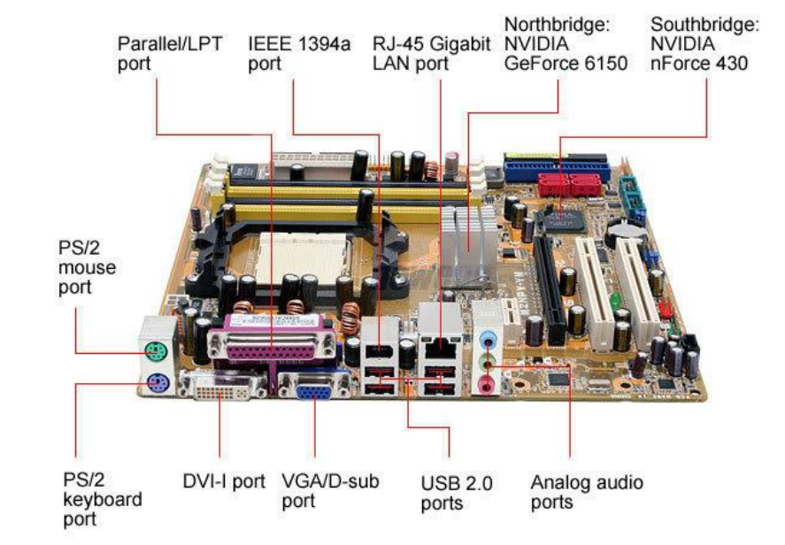

## Outras Placas

### Tipos de Placas

- OnBoard: Os dispositivos de vídeo, áudio, modem e rede são integrados na placa-mãe.

- OffBoard: placas desse tipo são apenas conectadas a placa-mãe, através de slots.

### Placa de Vídeo

> Placa de vídeo, também chamada de adaptador de vídeo ou aceleradora gráfica, é um componente de um computador que envia sinais deste para o monitor, de forma que possam ser apresentadas imagens ao utilizador.

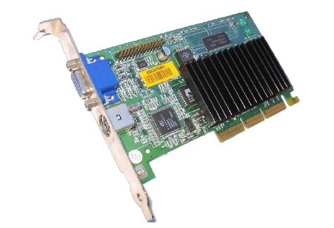

### Placa de Som

> Placa de som é um dispositivo de hardware que envia e recebe sinais sonoros entre equipamentos de som e um computador executando um processo de conversão entre a forma digital e analógica para outros periféricos como fones de ouvido e caixas de som.

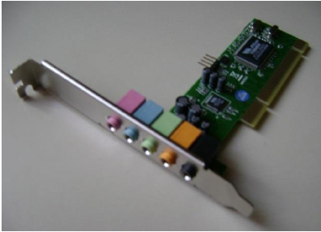

### Placa de Rede

> Uma placa de rede (também chamada adaptador de rede ou NIC, do acrônimo inglês Network Interface Card) é um dispositivo de hardware responsável pela comunicação (envio e recepção de dados) entre os computadores de uma rede.

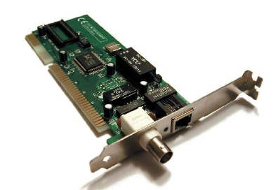

## Portas

Temos portas físicas e portas lógicas.

### Serial 

- A interface serial ou porta serial, também conhecida como RS-232 é uma porta de comunicação utilizada para conectar modems, mouses, algumas impressoras, scanners e outros equipamentos de hardware. 

- Na interface serial, os bits são transferidos em fila, ou seja, um bit de dados de cada vez.

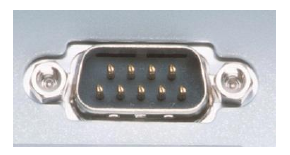

### Paralela 

- A porta paralela é uma interface de comunicação entre um computador e um periférico. 

- Na comunicação em paralelo, grupos de bits são transferidos simultaneamente (em geral, byte a byte) através de diversas linhas condutoras dos sinais. Desta forma, como vários bits são transmitidos simultaneamente a cada ciclo, a taxa de transferência de dados é alta.

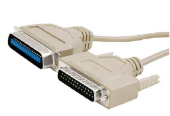

### PS/2 

- Personal System/2 ou PS/2 são conectores seriais de
periféricos. Os conectores PS/2 são usados até hoje em PCs
modernos desafiando a praticidade do USB. Placa-mães, mouses e teclados usam esta interface por ocuparem menos espaço e liberar as conexões USB para periféricos. 

- Em 1997 foram definidas cores para os padrões de entrada/saída dos PCs e os conectores PS/2 ganharam as cores lilás para teclado e verde para mouse.

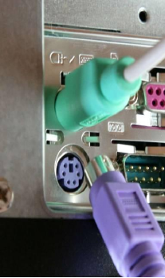

### USB 

- Universal Serial Bus (USB) é um tipo de conexão "ligar e usar" (plug n' play) que permite a conexão de periféricos sem a necessidade de desligar o computador.

- O surgimento do padrão PnP (Plug and Play) diminuiu toda a complicação existente na configuração de dispositivos de um computador. O objetivo do padrão PnP foi tornar o usuário sem experiência capaz de instalar um novo periférico e usá-lo imediatamente. Mas esse padrão ainda era suscetível a falhas, o que causava dificuldades para alguns usuários. 

- O USB Implementers Forum foi concebido na óptica do conceito de Plug and Play, revolucionário na altura da expansão dos computadores pessoais, feito sobre um barramento que adota um tipo de conector que deve ser comum a todos os aparelhos que o usarem, assim tornando fácil a instalação de periféricos que adotassem essa tecnologia, e diminuiu o esforço de concepção de periféricos, no que diz respeito ao suporte por parte dos sistemas operacionais (SO) e hardware.

- As versões da porta USB.
    - USB 1.1. Taxa de transmissão de cerca de 1 MBps (1,5 a
12 Mbps)
    - USB 2.0. Taxa de transmissão de cerca de 60 MBps (480
Mbps)
    - USB 3.0. Taxa de transmissão de cerca de 600 MBps (4,8
Gbps)

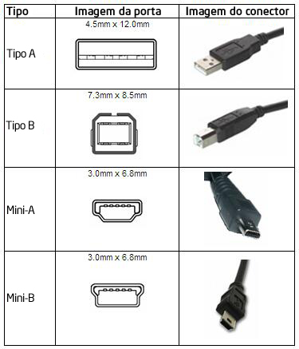

## Memórias

-  Memória são todos os dispositivos que permitem a um computador guardar dados, temporária ou permanentemente. 

- Memória é um termo genérico para designar componentes de um sistema capazes de armazenar dados e programas. O conceito de computador digital binário com programa armazenado (arquitetura de Von Neumann e subsequentes) é sempre baseado no uso de memória, e não existiria sem a utilização destas.

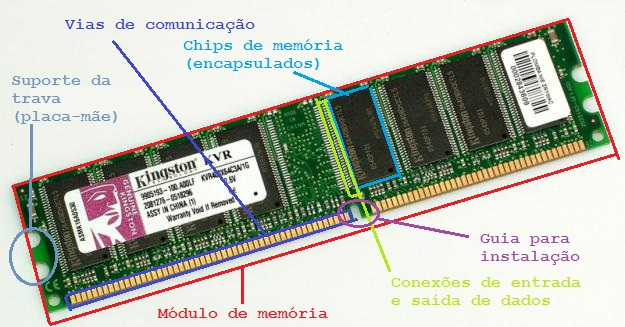

### Classificação quanto a volatilidade

#### Volátil 

- Memórias voláteis são as que requerem energia para manter a informação armazenada. 

- São fabricadas com base em duas tecnologias: dinâmica e estática.

    - Memória dinâmica: A memória dinâmica é a mais barata delas e, portanto, a mais utilizada nos computadores e são aquelas que foram popularizadas como memórias RAM.

    - Memória estática: A memória estática não necessita ser analisada ou recarregada a cada momento. Fabricada com circuitos eletrônicos conhecidos como latch, guardam a informação por todo o tempo em que estiver a receber alimentação.

#### Não Volátil

- Memórias não voláteis são aquelas que guardam todas as informações mesmo quando não estiverem recebendo alimentação. 

- Como exemplos, citam-se as memórias conhecidas por ROM e FLASH, bem como os dispositivos de armazenamento em massa, disco rígido, CDs e disquetes.

### Classificação quanto a portabilidade

#### Removível

- Dentre as formas de armazenagem na informática, a mídia removível se refere ao tipo de memória que pode ser removida do seu aparelho de leitura, conferindo portabilidade para os dados que carrega. 

- Um drive removível é um leitor deste tipo de mídia. Estes não podem ser confundidos com discos removíveis, que são drives de armazenamento próprio, que se destacam totalmente de suas bases.

#### Não Removível

- São tipos de mídias que não podem ser separadas dos equipamentos. Ficam ligadas/conectadas aos equipamentos. Também são conhecidas como “Discos Locais”. Ex: Disco Rígido.

### Classificação quanto ao uso

#### Primária

- A memória primária, também chamadas de memória real, são memórias que o processador pode endereçar diretamente, sem as quais o computador não pode funcionar. 

- A sua função principal é a de conter a informação necessária para o processador num determinado momento; esta informação pode ser, por exemplo, os programas em execução.

- Nesta categoria insere-se a memória RAM (volátil), memória ROM (não volátil), registradores e memórias cache.

    - **ROM:** A memória somente de leitura (acrónimo ROM (em inglês)) é um tipo de memória que permite apenas a leitura, ou seja, as suas informações são gravadas pelo fabricante uma única vez e após isso não podem ser alteradas ou apagadas, somente acessadas. São memórias cujo conteúdo é gravado permanentemente.

    - **RAM:** Memória de acesso aleatório (do inglês Random Access Memory, frequentemente abreviado para RAM) é um tipo de memória que permite a leitura e a escrita, utilizada como memória primária em sistemas eletrônicos digitais. O termo acesso aleatório identifica a capacidade de acesso a qualquer posição em qualquer momento, por oposição ao acesso sequencial, imposto por alguns dispositivos de armazenamento, como fitas magnéticas.

#### Secundária 

- Memória secundária são memórias que não podem ser
endereçadas diretamente, a informação precisa ser carregada em memória principal antes de poder ser tratada pelo processador. 

- Não são estritamente necessárias para a operação do computador. São geralmente não-voláteis, permitindo guardar os dados permanentemente. Incluem-se, nesta categoria, os discos rígidos, CDs, DVDs e disquetes.

    - **Ópticas:** Discos ópticos, como CDs e DVDs, e suas diversas variações.

    - **Flexíveis:** Discos magnéticos, como discos rígidos e disquetes - a principal tecnologia de implementação de memória secundária.

- Os Discos Rígidos se dividem pela tecnologia em:

    - SATA: Serial ATA, SATA ou S-ATA (acrônimo para Serial AT Attachment) é uma tecnologia de transferência de dados em série entre um computador e dispositivos de armazenamento em massa (mass storage devices) como unidades de disco rígido e drives ópticos. É o sucessor da tecnologia ATA (acrônimo de AT Attachment, introduzido em 1984 pela IBM em seu computador AT. ATA, também conhecido como IDE ou Integrated Drive Electronics) que foi renomeada para PATA (Parallel ATA) para se diferenciar de SATA.

    - RAID: Redundant Array of Independent Disks, também denominado Redundant Array of Inexpensive Disks, mais conhecido como simplesmente RAID ou ainda em português: Conjunto Redundante de Discos Independentes ou Arranjo Redundante de Discos Independentes. RAID seriam dois ou mais discos (por exemplo, HD ou disco rígido) trabalhando simultaneamente para um mesmo fim.

    - Flash (ou eletrônica): Memória flash é uma memória de computador do tipo EEPROM (Electrically-Erasable Programmable Read-Only Memory), desenvolvida na década de 1980 pela Toshiba, cujos chips são semelhantes ao da Memória RAM, permitindo que múltiplos endereços sejam apagados ou escritos numa só operação. Em termos leigos, trata-se de um chip re-escrevível que, ao contrário de uma memória RAM convencional, preserva o seu conteúdo sem a necessidade de fonte de alimentação. Esta memória é comumente usada em cartões de memória, flash drives USB (pen drives), MP3 Players, dispositivos como os iPods com suporte a vídeo, PDAs, armazenamento interno de câmeras digitais e celulares. Memória flash é do tipo não volátil o que significa que não precisa de energia para manter as informações armazenadas no chip.

<!--Auxiliar
a. Buffer: Em ciência da computação, buffer é uma região de memória temporária utilizada para escrita e leitura de dados. Os dados podem ser originados de dispositivos (ou processos) externos ou internos ao sistema. Os buffers podem ser implementados em software (mais usado) ou hardware. Normalmente são utilizados quando existe uma diferença entre a taxa em que os dados são recebidos e a taxa em que eles podem ser processados, ou no caso em que essas taxas são variáveis. Os buffers são mecanismos muito utilizados em
aplicações multimídia, em especial nas aplicações de streaming.

b. Cache: Na área da computação, cache é um dispositivo de acesso rápido, interno a um sistema, que serve de intermediário entre um operador de um processo e o dispositivo de armazenamento ao qual esse operador acede. A vantagem principal na utilização de uma cache consiste em evitar o acesso ao dispositivo de armazenamento - que pode ser demorado -, armazenando os dados em meios de acesso mais rápidos-->

#### Virtual 

- A memória virtual consiste em recursos de hardware e software com três funções básicas: 

    - Assegurar que cada processo (aplicação) tenha o seu próprio espaço de endereçamento, começando em zero (problema de recolocação ou relocação); 

    - Proteção, para impedir que um processo utilize um endereço de memória que não lhe pertença; 

    - Possibilitar que uma aplicação utilize mais memória do que a fisicamente existente (essa é a função mais conhecida).

## Periféricos

- Periféricos são aparelhos ou placas de expansão que enviam ou recebem informações do computador. 

- Na informática, o termo "periférico" aplica-se a qualquer equipamento ou acessório que seja ligado à CPU (unidade central de processamento), ou, em um sentido mais amplo, ao computador. 

- Exemplos de periféricos são: impressoras, digitalizadores, leitores e gravadores (drives) de CDs e DVDs, leitores de cartões de memória e disquetes, mouses, teclados, câmeras de vídeo, entre outros.

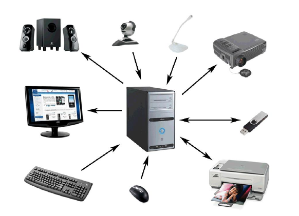

### Principais Periféricos

#### Mouse 

- Mouse é um periférico de entrada que, historicamente, se juntou ao teclado como auxiliar no processo de entrada de dados, especialmente em programas com interface gráfica. 

- O mouse tem como função movimentar o cursor (apontador) pela tela do computador. 

- Foi criado pela Xerox mas somente se tornou um produto comercializado com a Apple.

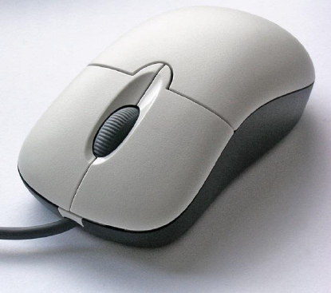

#### Teclado 

- Na computação, o teclado de computador é um dispositivo semelhante á máquina de escrever que possui uma série de botões ou teclas, e utilizado para inserir dados no computador. 

- É um tipo de periférico de entrada utilizado pelo usuário para a entrada manual no sistema de dados e comandos. Possui teclas representando letras, números, símbolos e outras funções, baseado no modelo de teclado das antigas máquinas de escrever.

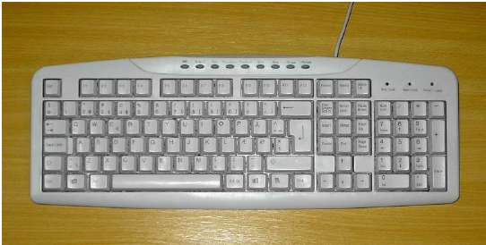

#### Tela (monitor) 

- O monitor é um dispositivo de saída do computador, cuja função é transmitir informação ao utilizador através da imagem.

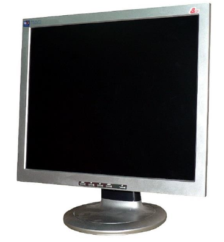

#### Impressora 

- Impressora ou dispositivo de impressão é um periférico que, quando conectado a um computador ou a uma rede de computadores, tem a função de dispositivo de saída, imprimindo textos, gráficos ou qualquer outro resultado de uma aplicação.

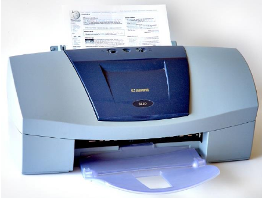

#### Scanner 

- Digitalizador ou escâner (do inglês scanner) é um
periférico de entrada responsável por digitalizar imagens, fotos e textos impressos para o computador, um processo inverso ao da impressora.

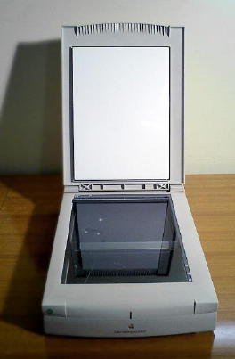

#### Roteador 

- Roteador é um dispositivo que encaminha pacotes de dados entre redes de computadores, criando um conjunto de redes de sobreposição. 

- Um roteador é conectado a duas ou mais linhas de dados de redes diferentes. Quando um pacote de dados chega, em uma das linhas, o roteador lê a informação de endereço no pacote para determinar o seu destino final. Em seguida, usando a informação na sua política tabela de roteamento ou encaminhamento, ele direciona o pacote para a rede de próxima em sua viagem. 

- Os roteadores são os responsáveis pelo "tráfego" na Internet. Os roteadores mais modernos necessitam de um cabo de banda larga ligado a um modem como entrada, e geralmente
transmitem o sinal de internet através de conectividade sem fio e 4 cabos banda larga. 

- Eles utilizam tabelas de rotas para decidir sobre o encaminhamento de cada pacote de dados recebido.

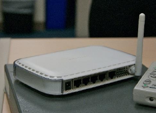

