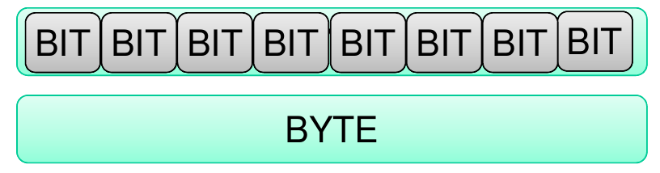
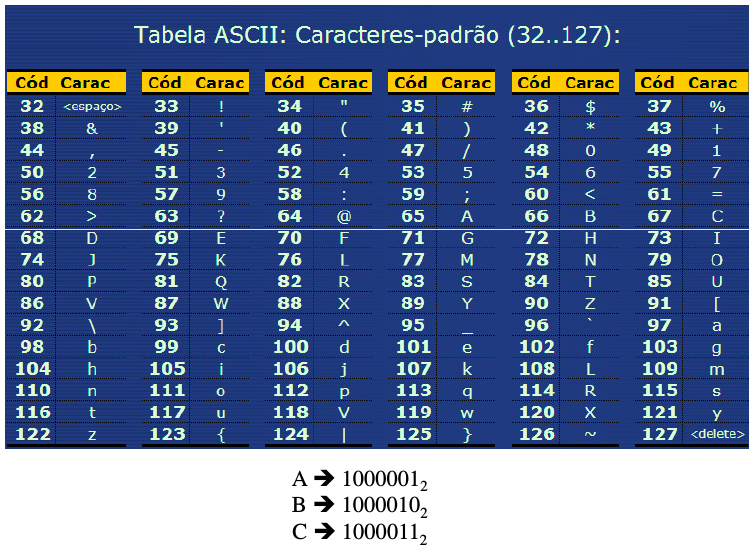
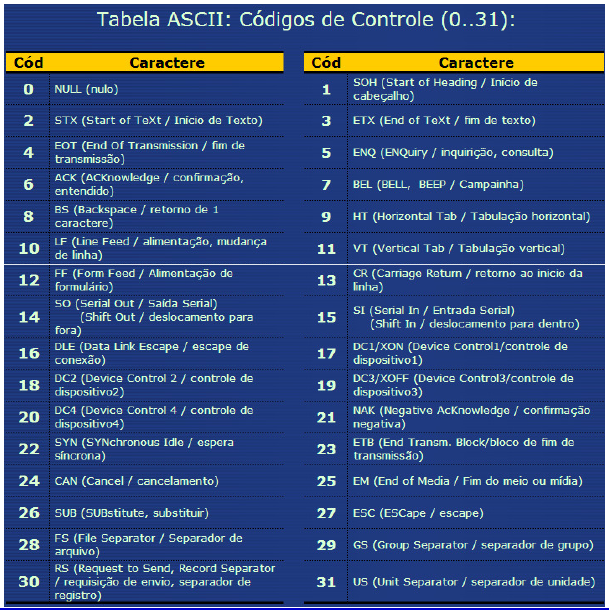
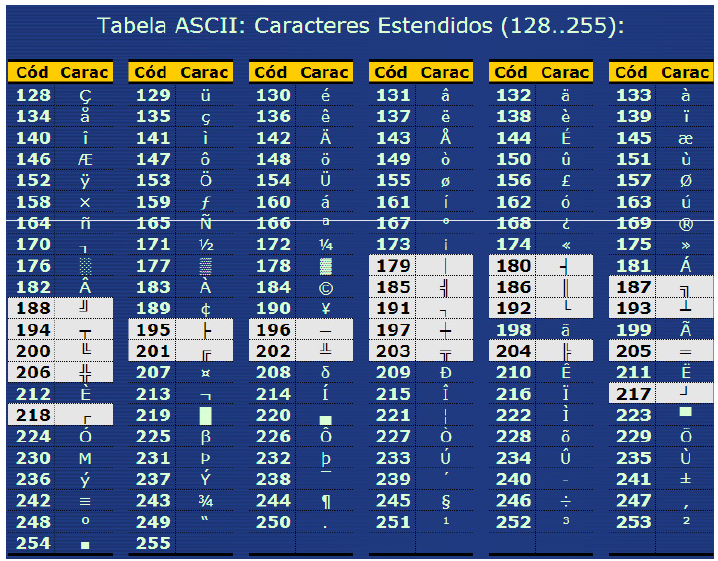

# Sistemas de medidas

Da mesma maneira que usamos algumas medidas para saber quanto pesam ou medem as coisas, também usamos unidades de medida que permitem calcular a capacidade de armazenamento de informações ou processamentos de dados em um computador.

## Bits e Bytes

Não é possível medir a quantidade de informação armazenada por um computador utilizando as unidades de medida convencionais. Para esta finalidade, foram criadas unidades de medidas específicas:

- **Bit (Binary Digit):** É a menor unidade de medida que possa ser armazenada. Um computador não interpreta os caracteres como nós, para ele há apenas duas formas de se ver um digito, SIM ou NÃO, CERTO ou ERRADO, 0 (zero) ou 1 (um). Ele só entende a presença do impulso elétrico 1 (um), e a falta dele 0 (zero).

- **Byte:** É um conjunto de 8 Bits que combinados formam 1 caractere (uma letra, um símbolo, um acento, etc.) que servem para comandar o computador e que podem também ser enviados pelo teclado ou por outro dispositivo de entrada de dados e instruções. 

Por exemplo: os códigos enviados a impressoras para controlar a impressão têm oito bits, os valores trocados pelos modems entre computadores também, assim como diversas outras operações elementares de intercâmbio de informações. Além disso, memórias costumam ser organizadas de tal forma que as operações de leitura e escrita são feitas com quantidades de um byte ou de um múltiplo de bits (oito, dezesseis, trinta e dois, sessenta e quatro ou cento e vinte e oito bits – o que corresponde a um, dois, quatro, oito e dezesseis bytes, respectivamente).

## Codificação

Em seu nível mais baixo, tudo (letras, algarismos, sinais de pontuação, símbolos, comandos) no computador é representado por dígitos binários.

Para que isso aconteça, os computadores utilizam uma tabela que combina números binários com símbolos: a tabela **ASCII** (American Standard Code for Information Interchange). Nela, cada byte representa um caractere ou um sinal.

A tabela ASCII original utiliza 7 bits de um Byte para representar caracteres.

Já a ASCII estendida utiliza 8 bits de um Byte para representar caracteres.

## Demais unidades de medidas

Bits, bytes e seus múltiplos são utilizados para quantificar capacidade de armazenamento.

|Nome|Sigla|Medida|Bytes|Caracteres|
|---|---|---|---|---|	 
|Byte|B|8 bits|1 byte|1|
|Kilobyte|KB|1.024 bytes|210 bytes|1.024|
|Megabyte|MB|1.024 KB|220 bytes|1.048.576|
|Gigabyte|GB|1.024 MB|230 bytes|1.073.741.824|
|Terabyte|TB|1.024 GB|240 bytes|1.099.511.627.776|
|Petabyte|PB|1.024 TB|250 bytes|1.125.899.906.842.624|
|Exabyte|HB|1.024 PB|260 bytes|1.152.921.504.606.846.976|
|Zettabyte|HB|1.024 EB|270 bytes|1.180.591.620.717.411.303.424|
|Yottabyte|YB|1.024 ZB|280 bytes|1.208.925.819.614.630.000.000.000|

Portanto, concluímos que, por exemplo, quando se diz que um disco rígido tem capacidade de armazenamento de 4,3 Gb, são armazenados aproximadamente 4 milhões e 500 mil caracteres.

No caso do quilo e de outras medidas de nosso dia a dia, a estrutura numérica é construída sobre a base 10, definida pelo **Sistema Internacional de Unidades - SI**. 

O termo quilo representa a milhar constituída de alguma coisa. Nossa base de trabalho numérica, sendo 10, faz com que, quando a base é elevada à terceira potência, atinja a milhar exatamente com 1000 unidades.

Mas, quando falamos em bytes, grupos de bits, não estamos falando em base 10, mas sim em uma estrutura fundamentada no código binário, ou seja, na base 2, nos 2 modos que o computador detecta, geralmente chamados de 0 e 1.

Assim, quando queremos um quilo de bytes, temos que elevar essa base a algum número inteiro, até conseguir atingir a milhar.

Mas não há número inteiro possível que atinja exatamente o valor 1.000. Então, ao elevarmos a base 2 à décima potência, teremos 1024.

Uma solução para esse impasse está nas terminologias e abreviações que a **International Electrotechnical Commission (IEC)** criou para indicar as medições baseadas em 1024 bytes, que são as seguintes:

- 1 kibibyte (ou KiB) = 1024 bytes
- 1 mebibyte (ou MiB) = 1024 kibibytes
- 1 gibibyte (ou GiB) = 1024 mebibytes
- 1 tebibyte (ou TiB) = 1024 gibibytes
- 1 pebibyte (ou PiB) = 1024 tebibytes
- 1 exbibyte (ou EiB) = 1024 pebibytes
- 1 zebibyte (ou ZiB) = 1024 exbibytes
- 1 yobibyte (ou YiB) = 1024 zebibytes

As mesmo medidas dos nomes acima são usados também nas medições baseadas em bits: 

- bit ( bit)
- Kibibit (Kibit) = 1024 bits = 210 bits
- Mebibit (Mibit) = 1024 Kibit = 220 bits
- Gibibit (Gibit) = 1024 Mibit = 230 bits
- Tebibit (Tibit) = 1024 Gibit = 240 bits
- Pebibit (Pibit) = 1024 Tibit = 250 bits
- Exbibit (Eibit) = 1024 Pibit = 260 bits
- Zebibit (Zibit) = 1024 Eibit = 270 bits
- Yobibit (Yibit) = 1024 Zibit = 280 bits

A representação de múltiplos binários por meio de prefixos decimais, que é de uso corriqueiro, não faz sentido, mesmo quando signifique uma aproximação. 

Houve um tempo em que as redes tinha desempenho da ordem de quilobits por segundo, as memórias tinham capacidade de quibibytes, e o armazenamento em disco contava-se em megabytes (pelos fabricantes) ou mebibytes (alguns sistemas operacionais usam potências de dois para unidades de armazenamento). 

A diferença no uso de um ou outro padrão era de pouco mais de dois por cento nos dois primeiros casos, e menos de cinco por cento no último. Hoje em dia, quando as redes atingiram o desempenho de gigabits por segundo, as memórias têm capacidade de gibibytes, e o armazenamento atingiu terabytes (ou tebibytes) e petabytes (ou pebibytes) de dados, as diferenças chegam a 10% e 12,6% respectivamente.

## Medições relacionadas a Bits

Na transmissão de dados entre dispositivos, geralmente usa-se medições relacionadas a bits e não a bytes. Assim, há também os seguintes termos:

- 1 kilobit (Kb ou Kbit) = 1024 bits
- 1 megabit (Mb ou Mbit) = 1024 Kilobits
- 1 gigabit (Gb ou Gbit) = 1024 Megabits
- 1 terabit (Tb ou Tbit) = 1024 Gigabits
E assim por diante. 

Quando a medição é baseada em bytes, a letra 'b' da sigla é maiúscula (como em GB). Quando a medição é feita em bits, o 'b' da sigla fica em minúsculo (como em Gb).

Como já dito, a utilização de medições em bits é comum para informar o volume de dados em transmissões. 

Geralmente, indica-se a quantidade de bits transmitidos por segundo. Assim, quando queremos dizer que um determinado dispositivo é capaz de trabalhar, por exemplo, com 54 megabits por segundo, usa-se a expressão 54 Mb/s:

- 1 Kb/s = 1 kilobit por segundo
- 1 Mb/s = 1 megabit por segundo
- 1 Gb/s = 1 gigabit por segundo
E assim por diante.