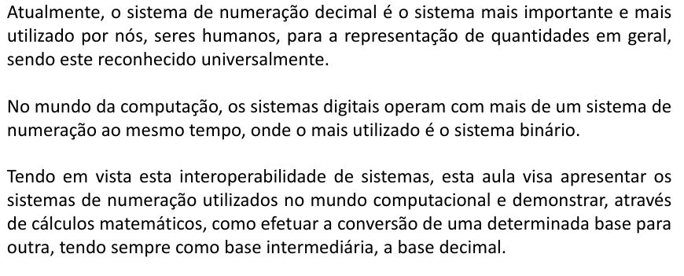
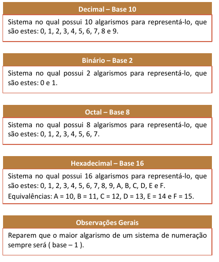
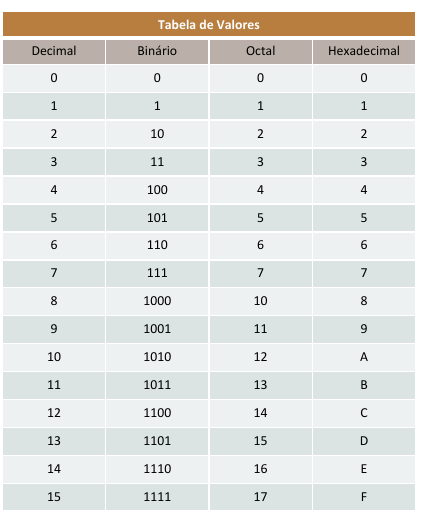
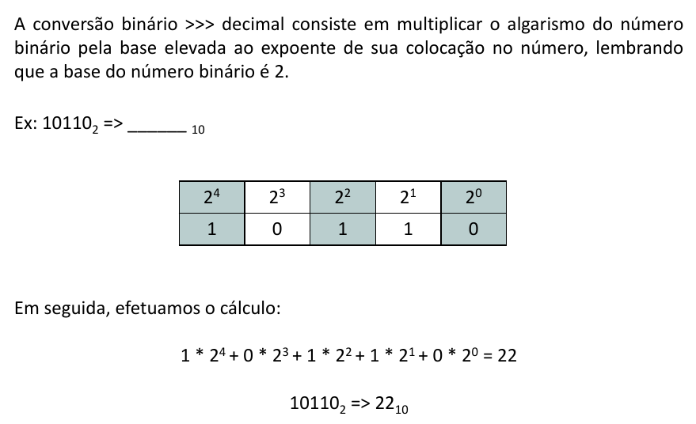
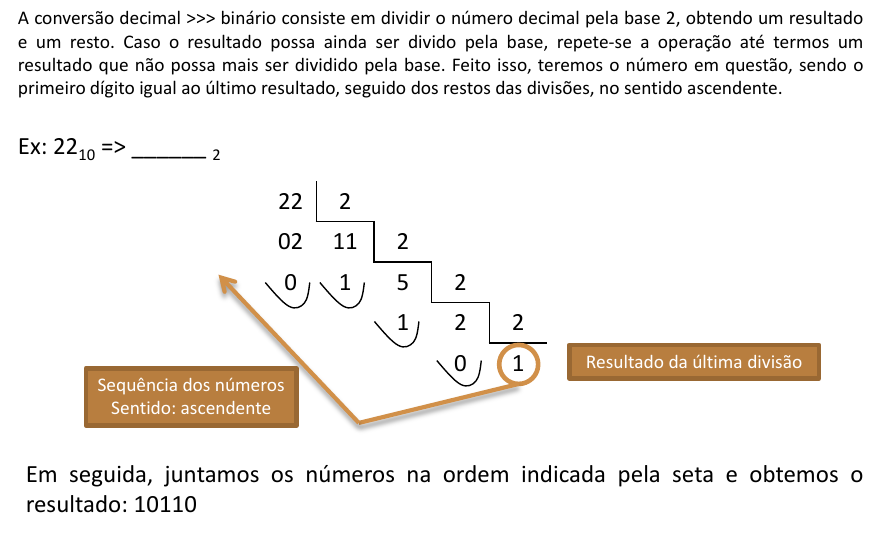
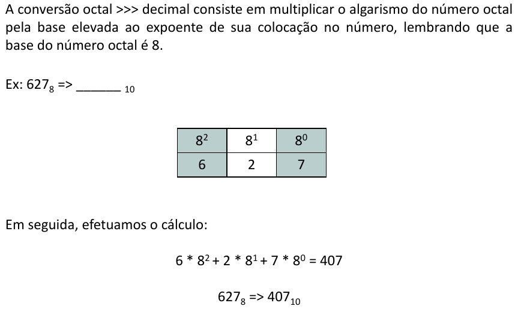
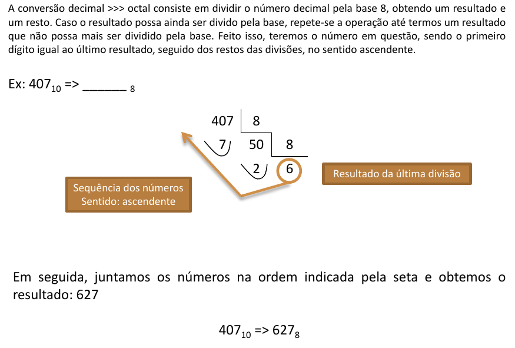
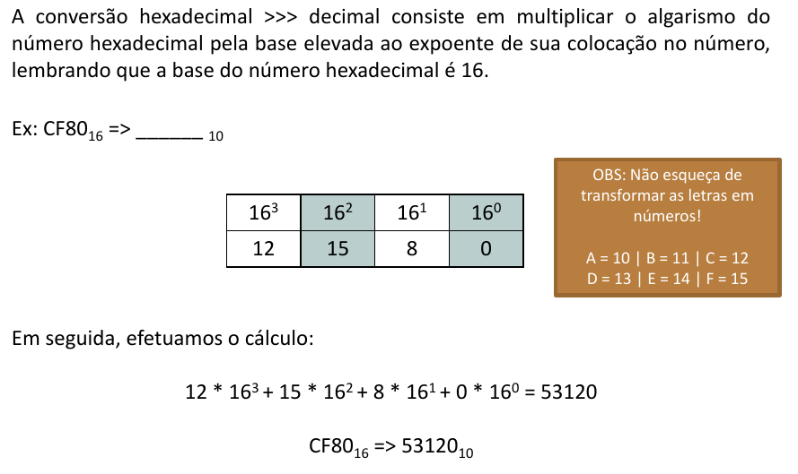
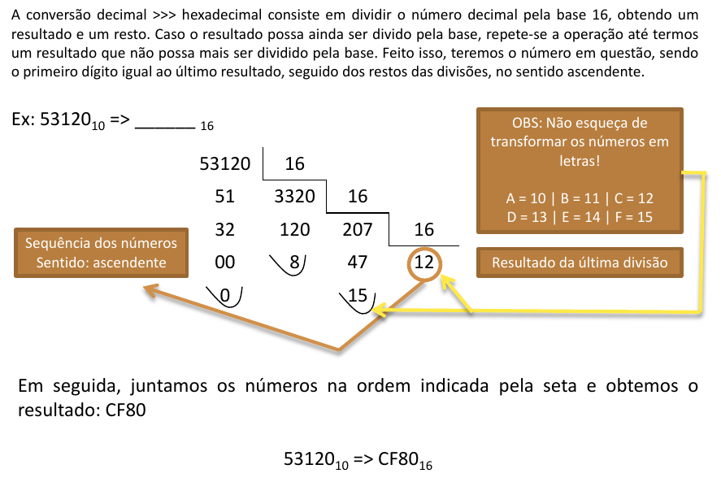

# Sistemas de numeração

# Conversão entre bases

## Conversão de binário para decimal

## Conversão de decimal para binário

## Conversão de octal para decimal

## Conversão de decimal para octal

## Conversão de hexadecimal para decimal

## Conversão de decimal para hexadecimal

# Exercícios

5010 => ______ 2

1100112 => ______ 10

7510 => ______ 2

10012 => ______ 10

29610 => ______ 8

1428 => ______ 10

100010 => ______ 8

77658 => ______ 10

22310 => ______ 16

7A216 => ______ 10

1688910 => ______ 16

FADA16 => ______ 10

---

<a href='solucao.md' id='solucao' class='anchor' aria-hidden='true'>Exercícios - Solução >></a>
